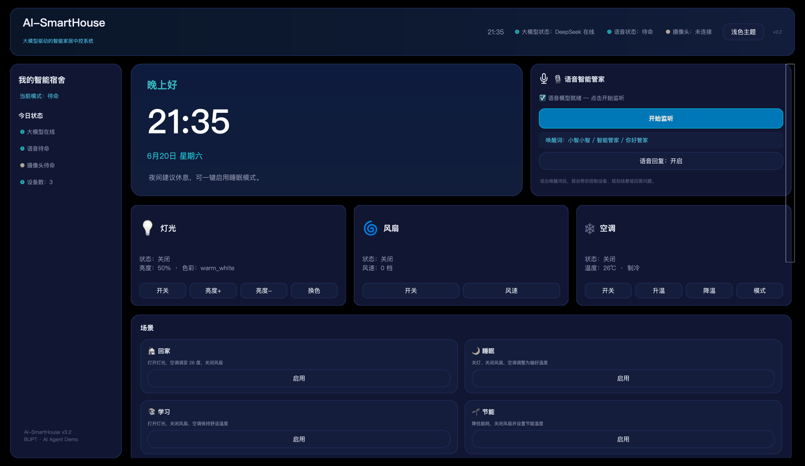
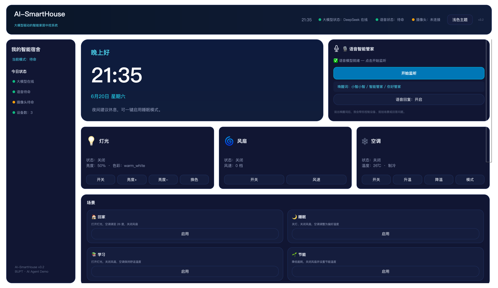
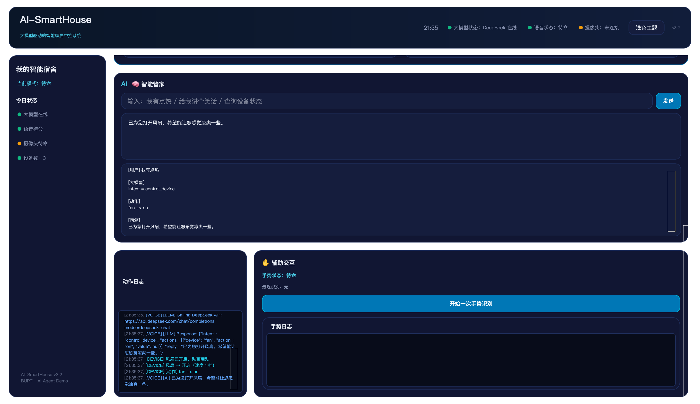
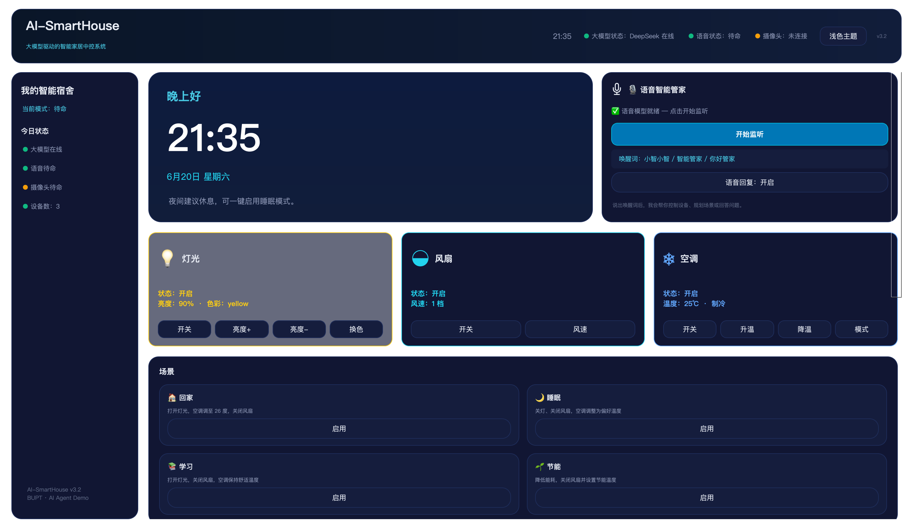
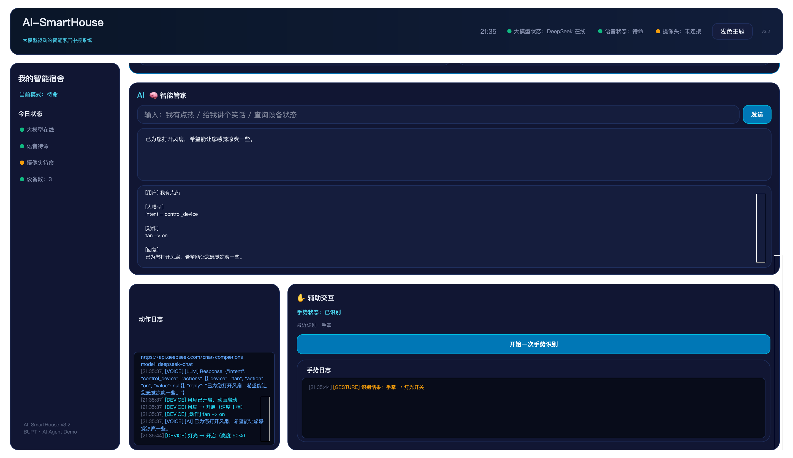
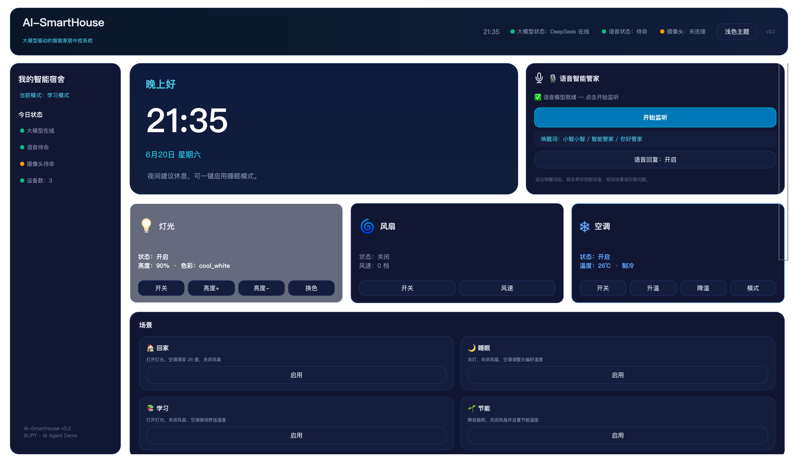
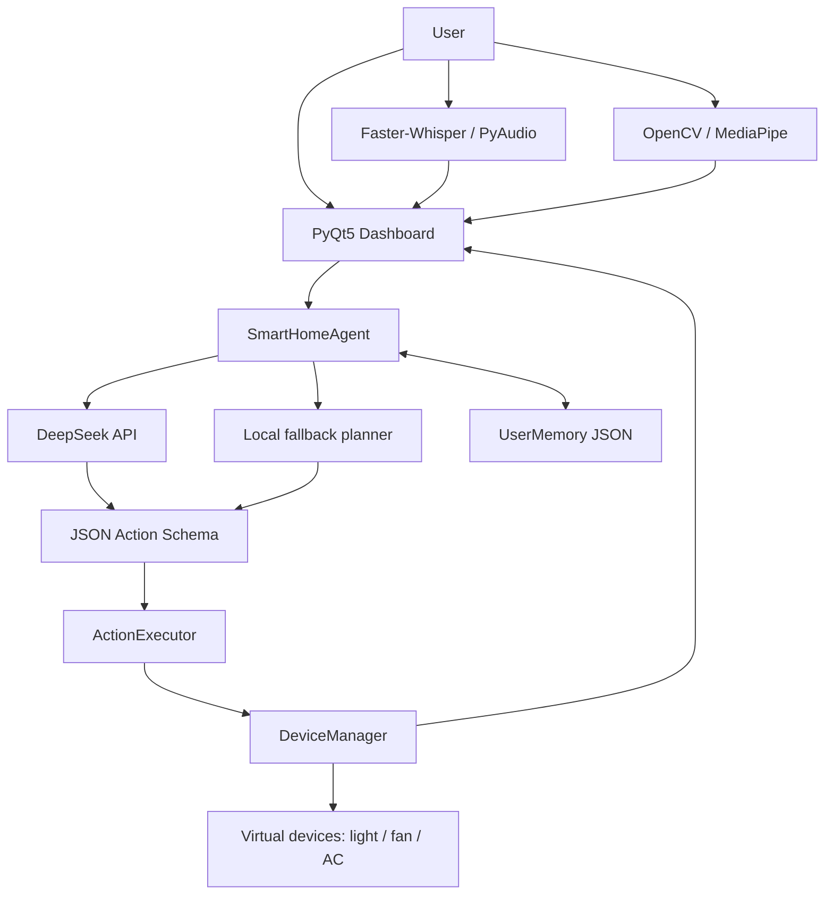

# SmartVoiceSystem

SmartVoiceSystem is a Python smart-home control demo built around a PyQt5 dashboard, a DeepSeek-powered Agent, voice input, gesture input, local user memory, and virtual device control.

The project demonstrates a complete local control loop:

```text
natural language / voice / gesture -> Agent planning -> JSON Action Schema -> DeviceManager -> PyQt5 Dashboard
```

## Screenshots





| AI Command | Device State |
| --- | --- |
|  |  |

| Gesture Control | Scene Mode |
| --- | --- |
|  |  |

## Project Overview

SmartVoiceSystem, also shown in the UI as **AI-SmartHouse**, is a product-style Chinese smart-home Agent demo. It does not depend on real hardware. Instead, it simulates lights, a fan, and an air conditioner in memory, then visualizes their status in a desktop dashboard.

The main value of the project is the execution chain: user intent is converted into structured JSON actions, validated, executed against virtual devices, and reflected in the UI with logs and state changes.

## Core Capabilities

- DeepSeek API Agent for natural-language smart-home planning.
- Strict JSON Action Schema for `intent`, `actions`, and `reply`.
- Local fallback rules when the API key is missing or the network/API call fails.
- PyQt5 dashboard with device cards, status indicators, logs, theme switching, and scene controls.
- Virtual device model for light, fan, and air conditioner.
- User preference memory backed by `memory/user_memory.json`.
- Faster-Whisper + PyAudio speech recognition workflow.
- MediaPipe hand-gesture recognition with camera frames and gesture logs.
- Scene modes: home, sleep, study, and energy saving.

## Tech Stack

- Python
- PyQt5
- DeepSeek API
- JSON Action Schema
- Faster-Whisper
- PyAudio
- OpenCV
- MediaPipe
- NumPy
- python-dotenv
- certifi

## System Architecture



## Project Structure

```text
SmartVoiceSystem/
├── main.py                     # PyQt5 dashboard and application entry
├── devices.py                  # Light, fan, AC, and DeviceManager
├── speech_worker.py            # PyAudio recording + Faster-Whisper transcription
├── gesture_worker.py           # OpenCV + MediaPipe gesture recognition
├── test_deepseek.py            # Standalone DeepSeek connectivity test
├── requirements.txt
├── .env.example
├── llm/
│   └── deepseek_client.py      # DeepSeek chat-completions client
├── agent/
│   ├── action_schema.py        # JSON parsing, validation, ActionExecutor
│   └── smart_home_agent.py     # LLM planning and local fallback logic
├── memory/
│   ├── user_memory.py          # JSON-backed preference memory
│   └── user_memory.json
├── models/
│   └── hand_landmarker.task    # MediaPipe hand model
├── assets/
│   ├── gui.png
│   ├── agent.png
│   └── gesture.png
└── screenshots/
    ├── 01_dashboard.png
    ├── 02_ai_command.png
    ├── 03_device_state.png
    ├── 04_gesture_control.png
    └── 05_scene_mode.png
```

## Quick Start

Install dependencies:

```bash
python -m venv .venv
source .venv/bin/activate
pip install -r requirements.txt
```

Create local environment config:

```bash
cp .env.example .env
```

Then add your own DeepSeek key:

```bash
DEEPSEEK_API_KEY=your_deepseek_api_key_here
```

Run the dashboard:

```bash
python main.py
```

DeepSeek connectivity test:

```bash
python test_deepseek.py
```

Do not commit `.env`.

## Feature Demo

| Input | Expected behavior |
| --- | --- |
| `我有点热` | Turns on the fan through Agent planning or fallback |
| `我要睡觉了` | Enables sleep mode, turns off light/fan, applies remembered AC temperature |
| `开启学习模式` | Turns on light, sets AC to a comfortable temperature, turns off fan |
| `查询设备状态` | Returns current virtual device status |
| Gesture: open palm | Toggles light |
| Gesture: fist | Toggles fan |
| Gesture: thumbs up/down | Adjusts AC temperature |

Example Agent result:

```json
{
  "intent": "control_device",
  "actions": [
    {
      "device": "fan",
      "action": "on",
      "value": null
    }
  ],
  "reply": "已为你打开风扇。"
}
```

## Highlights

- Agent-first architecture: natural language is converted into validated structured actions.
- Robust fallback: the demo still works when DeepSeek API is unavailable.
- Clear separation between planning, validation, execution, device state, and UI.
- User memory supports personalized scene behavior, such as preferred sleep temperature.
- PyQt5 dashboard gives the project a complete product-style presentation.
- Gesture and voice modules show multimodal interaction beyond simple text commands.

## Current Boundaries

- The project controls virtual devices only; it does not connect to real smart-home hardware.
- DeepSeek API requires a local `.env` key. Without it, local fallback planning is used.
- Speech recognition depends on microphone access and local audio environment.
- Gesture recognition depends on camera access and the MediaPipe model file in `models/`.
- `test_deepseek.py` is only for API testing and is not the normal application entry point.

## License

MIT License.
